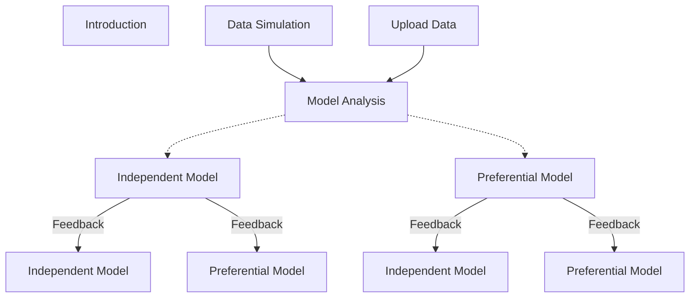

<h1> Shiny App for Spatial Modeling (RStudio & R-INLA) </h1>

This application is designed for the resolution of spatial models using the Bayesian paradigm and the INLA methodology. Therefore, we will explain its functionality and its main sections. Additionally, in this *README* file, the theoretical foundations underlying the application will be briefly presented. Which means, a summary of Bayesian inference and the foundaments of the INLA methodology.

To run this app you can use the function `runGitHub("ShinyAppSpatialModelFeedback", "MarioFigueiraP")` from `library(shiny)`.

<h1> App dependencies </h1>

As mentioned above, this application was built to solve spatial models, for which it needs several packages. Although these dependencies would be installed automatically when running the application itself, if the automatic process fails you can try to install these packages manually. Here is the code for it:

```
install.packages("shiny")
install.packages("shinydashboard")
install.packages("shinyWidgets")
install.packages("shinydashboardPlus")
install.packages("shinyBS")
install.packages("shinyjs")
install.packages("periscope")
install.packages("splines")
install.packages("INLA",
  repos=c(getOption("repos"),INLA="https://inla.r-inla-download.org/R/stable"), 
  dep=TRUE) # It is a core package for the app.
install.packages("inlabru")
install.packages("ggplot2")
install.packages("lattice")
install.packages("rintrojs")
install.packages("patchwork")
install.packages("viridis")
install.packages("rgeos")
install.packages("dplyr")
```

The INLA package installation could give some problems or errors[^1], in such case it is desirable to visit the [INLA home page](https://www.r-inla.org/), where the installation is explained in some detail and many FAQ are answered.

[^1]: As far as I know, errors might occur in the intallation process or after using some of its functions, e. g. if we install the default stable version of INLA in Linux Mint 18.2 Sonya we might not be able to solve spatial models or even simulate a spatial effect through <code>inla.qsample()</code> function. The only way I have managed to get INLA to work on Linux Mint 18.2 Sonya was by installing an alternative binary build, specifically using the function <code>  inla.binary.install(os="CentOS Linux-7")</code> over the default installation.

<h1> Main application sections </h1>

The app is made up of four major blocks:

1. Introduction: a brief introduction for the app.
2. Data Simulation: in this section is possible to simulate some spatial data.
3. Upload Data: it allows to read some data frame, but there are some rules in which the data must be configure in order to be read properly.
4. Model Analysis: in this section the simulated or uploaded data can be analyzed by the two available model structures, a geoestatistical model or a specific spatial joint model.

*Data Simulation* and *Upload Data* are sequentially linked to *Model Anaysis*, which means that data from one of the former are taken in the latter. Once the modelling is done, these results can be used to provide feedback or to perform a sequential learning process for a new data set from the same geostatistical phenomenon that could be modeled by one of the two proposed model structures, thanks to the control options available in INLA and configurable in this application.



<h2> 1. Data Simulation </h2>

Since the objective is to model spatial data sets, a section is provided within the tool to simulate spatial data by controlling their constitutive parameters. It means that we can build a sptail data set with which we could test the performance of the spatial analysis. Therefore, here we build a geostatistical data set from the following model structure:

$$
\begin{array}{c}
y_i \sim f(y_i|\boldsymbol\theta),\\
g(E(y_i)) = g(\mu_i) = \\beta_0 + \mathbf{X}_i\boldsymbol\beta + u_i.
\end{array}
$$

The steps for its simulation are:

- (i) Configure the study region parameters, its length and the resolution of the raster.
- (ii) Define the covariate formula in the "study region", $x=f(\mathbf{s})$.
- (iii) Select the type effect for the covariate: 
  - (a) linear,
  - (b) first order random walk,
  - (c) second order random walk, or
  - (d) a custom function, $f(x)$.
- (iv) Determine the spatial parameters, spatial range $\rho$ and marginal deviation $\sigma$, to simulate it.
- (v) Establish the coefficients for the intercep and for the covariate if it is a linear effect, and indicate the value of the likelihood variance.
- (vi) Finally, simulate the observational data from a Gaussian or a Gamma distribution.

From the resulting raster map two sample simulations could be done: 

- (i) a <i>independent sampling</i> (iid) or 
- (ii) a <i>preferential sampling</i> (ps). 

The <i>independent sampling</i> entails that each raster point (datum) has the same probability and it's done by the <code>sample(x=coord_i, size=n)</code>[^2] function, where we can specified the vector data $x$ and the $size$ of the sample:

$$
\forall i, \quad p_i = p = cte.
$$

The <i>preferential sampling</i> implies that the probability for each raster point is related to the geostatistical data $y_i$. Then, following the strategy set above we could do this sampling through <code>sample(x=coor_i, size=n, prob=p_i)</code>[^3]:  

$$
p_i = \frac{\exp[r\cdot y_i]}{\sum_i \exp[r\cdot y_i]\cdot S_i} \propto \exp[r\cdot y_i].
$$

[^2]: In a precise sense use this "method" would be absolutly incorrect, but if the number of samples are much lower than the number of raster points (the number of simulated data) then we could assume this as a valid approximation. The right mode would be simulate a homogeneus point process (homogeneous Poisson), evalauting its intesity function $\lambda$ by the condition over the whole process outcome $\Lambda = \iint \lambda(\mathbf{s}) dS$, the expected number of points $\Lambda$.
[^3]: We could say the same for preferential sampling as for independent sampling, except that for right preferential sampling we would simulate the samples from an inhomogeneous Poisson process.

<h2> 2. Upload data </h2>

This section allows to upload a data frame by the user (<i>Load Analysis Data Frame:</i>), but there are some conditions on the data frame to be read correctly by the application: the first two columns should be the coordinates, the third column the observation data and the others can be the covariates. there is another element of the user interface that enables reading a data frame of explanatory variables (<i>Load Covariates Data Frame</i>). 

<h2> 3. Model Analysis </h2>

This section presents the inference procedures for spatial data. The two model structures availables are (i) an <i>independent model</i> and (ii) a <i>preferential model</i>, which we will use depending on whether the data come from an independent or preferential sampling. The models proposed are Bayesian hierarchical models, which means that the model has to layers of parameters: (i) one layer of parameters directly related to the predictor $\eta_i$, called <i>latent</i> parameters, and (ii) a second layer in which the parameters are related to other parameters, called <i>hyperparameters</i>. Let's see this with a small example:

$$
\left\\{ \eta_i = \beta_0 + \mathbf{X_i}\cdot\boldsymbol\beta + \sum_j f_j(Z_{ij}) + u_i(\rho,\sigma) + \epsilon(\sigma) \right\\} \longleftarrow \text{Latent parameters}
$$

$$
\left\\{ u_i \sim N(\mathbf{0}, \Sigma(\rho,\sigma))\implies \Sigma(\rho,\sigma)=\sigma\cdot corr(\rho), \\; \epsilon(\sigma)\sim N(0,\sigma)  \right\\} \longleftarrow \text{Hyperparameters}
$$

<h3> 3.1 Independent Model </h3>

This first model is essentially the structure we have used to simulate the geostatistical data, but since we will now perform a Bayesian inference analysis the schema needs further specification: 

$$
\begin{array}{c}
y_i \sim f(y_i|\eta_i, \boldsymbol\theta) \\; : \\; f(\cdot)=\\{N(\cdot) \veebar Gamma(\cdot)\\}, \\
g(E(y_i)) = g(\mu_i) = \eta_i = \beta_0 + \mathbf{X_i} \boldsymbol\beta + u_i, \\
\boldsymbol\beta \sim N(\mathbf{0}, \Sigma_\beta) \\; : \\; \Sigma_{\beta}\sim diag(\sqrt{1000}, ..., \sqrt{1000}), \\
\mathbf{u} \sim N(\mathbf{0}, \Sigma(\rho, \sigma)),\\
\rho \sim pc_{\rho}(\rho_0, p_{\rho}) \\; : \\; pc_{\rho}(\rho_0, p_{\rho})\equiv \\{ P(\rho < \rho_0)=p_{\rho}\\},\\
\rho_0 = size/2, \\; p_{\rho} = 1/2,\\
\sigma \sim pc_{\sigma}(\sigma_{0}, p_{\sigma}) \\; : \\; pc_{\sigma}(\sigma_0, p_{\sigma})\equiv \\{ P(\sigma > \sigma_0)=p_{\sigma}\\},\\
\sigma_0 = 1, \\; p_{\sigma} = 1/2,\\
\log(\tau) \sim log-Gamma(1, 0.00005).
\end{array}
$$

Since there are a lot of termns we'll try to provide a synthetycal explanation of these line by line:

- (i) The first line describe the relation between the response or observational variable ($y_i$) and its distribution, giving the predictor $\eta_i$ and all the parameters $\boldsymbol\theta$. The application is focused on continuos variables, hence the gaussian and gamma distribution are the only available.
- (ii) The next one is the link function $g(\cdot)$ which evalautes the expected value of $y_i$ as $E(y_i)=\mu_i$. The link function could take several shapes, but the most usual are the identity function $g(E(y_i)) = E(y_i)$ for a gaussian likelihoods and the log function $g(E(y_i))=\log\[E(y_i)\]$ for gamma likelihoods. This line could be named as "the model formula" since links the predictor (describe by the explanatory variables) with some expected measure of the observational variable distribution, e. g. the mean is the most common used or it could be modeling the variance instead. Therefore, $\beta_0$ is the intercept, $\beta$
- (iii) The Bayesian inference implies a definition of prior distributions for the parameters to fit a model, then the third line described the prior distribution of these parameters[^4] (latent field parameters)  


[^4]: 

<h3> 3.2 Preferential Model </h3>

In preferential sampling processes we have that the sampling process shares information with the underlying phenomon of study, the geostatistical process


