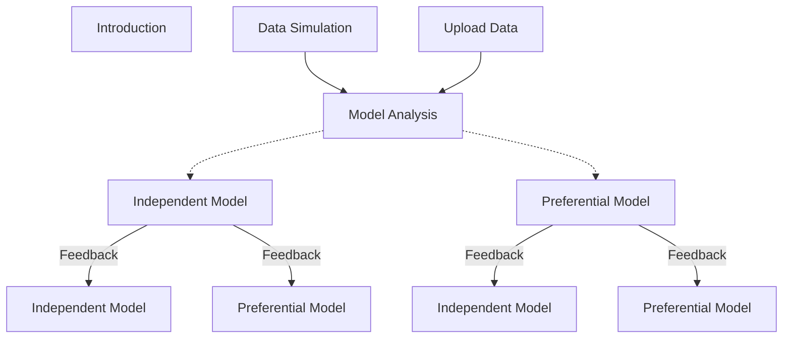

<h1> Shiny App for Spatial Modeling (RStudio & R-INLA) </h1>

This application is designed for the resolution of spatial models using the Bayesian paradigm and the INLA methodology. Therefore, we will explain its functionality and its main sections. Additionally, in this *README* file, the theoretical foundations underlying the application will be briefly presented. Which means, a summary of Bayesian inference and the foundaments of the INLA methodology.

To run this app you can use the function `runGitHub("ShinyAppSpatialModelFeedback", "MarioFigueiraP")` from `library(shiny)`.

<h1> App dependencies </h1>

As mentioned above, this application was built to solve spatial models, for which it needs several packages. Although these dependencies would be installed automatically when running the application itself, if the automatic process fails you can try to install these packages manually. Here is the code for it:

```
install.packages("shiny")
install.packages("shinydashboard")
install.packages("shinyWidgets")
install.packages("shinydashboardPlus")
install.packages("shinyBS")
install.packages("shinyjs")
install.packages("periscope")
install.packages("splines")
install.packages("INLA",
  repos=c(getOption("repos"),INLA="https://inla.r-inla-download.org/R/stable"), 
  dep=TRUE) # It is a core package for the app.
install.packages("inlabru")
install.packages("ggplot2")
install.packages("lattice")
install.packages("rintrojs")
install.packages("patchwork")
install.packages("viridis")
install.packages("rgeos")
install.packages("dplyr")
```

The INLA package installation could give some problems or errors[^1], in such case it is desirable to visit the [INLA home page](https://www.r-inla.org/), where the installation is explained in some detail and many FAQ are answered.

[^1]: As far as I know, errors might occur in the intallation process or after using some of its functions, e. g. if we install the default stable version of INLA in Linux Mint 18.2 Sonya we might not be able to solve spatial models or even simulate a spatial effect through <code>inla.qsample()</code> function. The only way I have managed to get INLA to work on Linux Mint 18.2 Sonya was by installing an alternative binary build, specifically using the function <code>  inla.binary.install(os="CentOS Linux-7")</code> over the default installation.

<h1> Main application sections </h1>

The app is made up of four major blocks:

1. Introduction: a brief introduction for the app.
2. Data Simulation: in this section is possible to simulate some spatial data.
3. Upload Data: it allows to read some data frame, but there are some rules in which the data must be configure in order to be read properly.
4. Model Analysis: in this section the simulated or uploaded data can be analyzed by the two available model structures, a geoestatistical model or a specific spatial joint model.

*Data Simulation* and *Upload Data* are sequentially linked to *Model Anaysis*, which means that data from one of the former are taken in the latter. Once the modelling is done, these results can be used to provide feedback or to perform a sequential learning process for a new data set from the same geostatistical phenomenon that could be modeled by one of the two proposed model structures, thanks to the control options available in INLA and configurable in this application.



<h2> 1. Data Simulation </h2>

Since the objective is to model spatial data sets, a section is provided within the tool to simulate spatial data by controlling their constitutive parameters. It means that we can build a sptail data set with which we could test the performance of the spatial analysis. Therefore, here we build a geostatistical data set from the following model structure:

$$
\begin{array}{c}
y_i \sim f(y_i|\boldsymbol\theta),\\
g(E(y_i)) = g(\mu_i) = \\beta_0 + \mathbf{X}_i\boldsymbol\beta + u_i.
\end{array}
$$

From the resulting raster map two sample simulations could be done: 

- (i) a <i>independent sampling</i> (iid) or 
- (ii) a <i>preferential sampling</i> (ps). 

The <i>independent sampling</i> entails that each raster point (datum) has the same probability and it's done by the <code>sample(x, size)</code>[^2] function, where we can specified the vector data $x$ and the $size$ of the sample:

$$
\forall i, \quad p_i = p = cte.
$$

The <i>preferential sampling</i> implies that the probability for each raster point is related to the geostatistical data:  

$$
p_i = \frac{\exp[r\cdot y_i]}{\sum_i \exp[r\cdot y_i]\cdot S_i} \propto \exp[r\cdot y_i].
$$


[^2]: In a precise sense use this "method" would be absolutly incorrect, but if the number of samples are much lower than the number of raster points (the number of simulated data) then we could assume this as a valid approximation. The right mode would be simulate a homogeneus point process (homogeneous Poisson), evalauting its intesity function $\lambda$ by the condition over the whole process result $\Lambda = \oiint \lambda(\mathbf{s}) dS$, the expected number of points $\Lambda$. 

<h2> 2. Upload data </h2>

<h2> 3. Model Analysis </h2>

