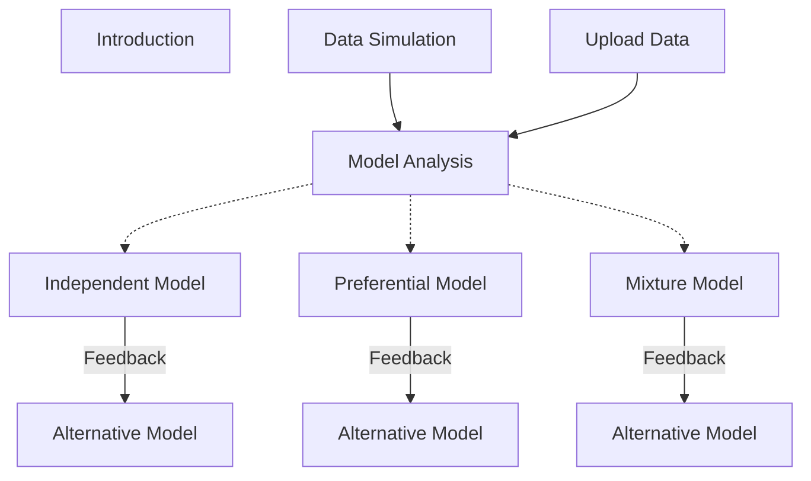

<h1> Shiny App for Spatial Modeling (RStudio & R-INLA) </h1>

This application is designed for the resolution of spatial models using the Bayesian paradigm and the INLA methodology. Therefore, since it has been designed for all kinds of users, we will explain in some detail its functionality and its main sections. <!--Additionally, in this *README* file, the theoretical foundations underlying the application will be briefly presented. Which means, a summary of Bayesian inference and the foundaments of the INLA methodology.-->

To run this app you can use the function `runGitHub("ShinyAppSpatialModelFeedback", "MarioFigueiraP")` from `library(shiny)`.

<h1> App dependencies </h1>

As mentioned above, this application was built to solve spatial models, for which it needs several packages. Although these dependencies would be installed automatically when running the application itself, if the automatic process fails you can try to install these packages manually. Here is the code for it:

```
install.packages("shiny")
install.packages("shinydashboard")
install.packages("shinyWidgets")
install.packages("shinydashboardPlus")
install.packages("shinyBS")
install.packages("shinyjs")
install.packages("periscope")
install.packages("splines")
install.packages("INLA",
  repos=c(getOption("repos"),INLA="https://inla.r-inla-download.org/R/stable"), 
  dep=TRUE)
install.packages("inlabru")
install.packages("ggplot2")
install.packages("lattice")
install.packages("rintrojs")
install.packages("patchwork")
install.packages("viridis")
install.packages("rgeos")
install.packages("dplyr")
```

The INLA package installation could give some problems or errors[^1], in such case it is desirable to visit the [INLA home page](https://www.r-inla.org/), where the installation is explained in some detail and many FAQ are answered.

[^1]: As far as I know, errors might occur in the intallation process or after using some of its functions, e. g. if we install the default stable version of INLA in Linux Mint 18.2 Sonya we might not be able to solve spatial models or even simulate a spatial effect through <code>inla.qsample()</code> function. The only way I have managed to get INLA working on Linux Mint 18.2 Sonya was by installing an alternative binary build, specifically using the function <code>  inla.binary.install(os="CentOS Linux-7")</code> over the default installation.

<h1> Main application sections </h1>

The app is made up of four major blocks:

1. Introduction: a brief introduction for the app.
2. Data Simulation: in this section is possible to simulate some spatial data.
3. Upload Data: it allows to read some data frame, but there are some rules in which the data must be configure in order to be read properly.
4. Model Analysis: in this section the simulated or uploaded data can be analyzed by the three available model structures, a geoestatistical model (independent model), specific spatial joint model (dependent model) or a joint model with heterogeneous point process structure (mixture model).

*Data Simulation* and *Upload Data* are sequentially linked to *Model Anaysis*, which means that data from one of the former are taken in the latter. Once the modelling is done, these results can be used to provide feedback or to perform a sequential learning process for a new data set from the same geostatistical phenomenon that could be modeled by one of the three proposed model structures, thanks to the control options available in INLA and configurable in this application.



<h2> 1. Data Simulation </h2>

Since the objective is to model spatial datasets, a section is provided within the tool to simulate spatial data by controlling their constitutive parameters. It means that we can build a spatial dataset with which we could test the performance of the spatial analysis. Therefore, here we build a geostatistical dataset from the following model structure:

$$
\begin{array}{c}
y_i \sim f(y_i|\boldsymbol\theta),\\
g(E(y_i)) = g(\mu_i) = \\beta_0 + f_X(x_i) + u_i.
\end{array}
$$

The steps for its simulation are:

- (i) Configure the study region parameters, its length and the resolution of the raster.
- (ii) Define the covariate formula in the "study region", $x=f(\mathbf{s})$.
- (iii) Select the type effect for the covariate: 
  - (a) linear,
  - (b) first order random walk,
  - (c) second order random walk, or
  - (d) a custom function, $f(x)$.
- (iv) Determine the spatial parameters, spatial range $\rho$ and marginal deviation $\sigma$, to simulate it.
- (v) Establish the coefficients for the intercep and for the covariate if it is a linear effect, and indicate the value of the likelihood variance.
- (vi) Finally, simulate the observational data from a Gaussian or a Gamma distribution.

From the resulting raster map three sample simulations could be done: 

- (i) an <i>independent sampling</i>, 
- (ii) a <i>preferential sampling</i> or
- (iii) a mixture of two  <i>preferential samples</i>.

The <i>independent sampling</i> entails that each raster point (each datum) has the same probability and it's done by the <code>sample(x=coord_i, size=n)</code>[^2] function, where we can specified the vector data $x$ and the $size$ of the sample:

$$
\forall i, \quad p_i = p = cte.
$$

The <i>preferential sampling</i> implies that the probability for each raster point is related to the geostatistical data $y_i$. Then, following the strategy set above we could do this sampling through <code>sample(x=coord_i, size=n, prob=p_i)</code>[^3]:

$$
p_i = \frac{\exp[r\cdot y_i]}{\sum_i \exp[r\cdot y_i]\cdot S_i} \propto \exp[r\cdot y_i].
$$

[^2]: In a precise sense use this "method" would be absolutly incorrect, but if the number of samples are much lower than the number of raster points (the number of simulated data) then we could assume this as a valid approximation. The right mode would be simulate a homogeneus point process (homogeneous Poisson), evalauting its intesity function $\lambda$ by the condition over the whole process outcome $\Lambda = \iint \lambda(\mathbf{s}) dS$, the expected number of points $\Lambda$.
[^3]: We could say the same for preferential sampling as for independent sampling, except that for right preferential sampling we would simulate the samples from an inhomogeneous Poisson process, specifically a log Gaussian Cox process (LGCP).

<h2> 2. Upload data </h2>

This section allows to upload a data frame by the user (<i>Load Analysis Data Frame:</i>), but there are some conditions on the data frame to be read correctly by the application: the first two columns should be the coordinates, the third column the observation data and the others can be the covariates. there is another element of the user interface that enables reading a data frame of explanatory variables (<i>Load Covariates Data Frame</i>). 

<h2> 3. Model Analysis </h2>

This section presents the inference procedures for spatial data. The three model structures availables are (i) an <i>independent model</i>, (ii) a <i>preferential model</i> and a <i>mixture model</i>, which we will use depending on whether the data come from an independent, preferential sampling or a data mixture from different samplers. The models proposed are Bayesian hierarchical models, which means that the model has to layers of parameters: (i) one layer of parameters directly related to the predictor $\eta_i$, called <i>latent parameters</i>, and (ii) a second layer in which the parameters are related to other parameters, called <i>hyperparameters</i>. Let's see this with a small example:

$$
\left\\{ \eta_i = \beta_0 + \mathbf{X_i}\cdot\boldsymbol\beta + \sum_j f_j(Z_{ij}) + u_i(\rho,\sigma) + \epsilon(\sigma) \right\\} \longleftarrow \text{Latent parameters}
$$

$$
\left\\{ \mathbf{u} \sim N(\mathbf{0}, \Sigma(\rho,\sigma))\implies \Sigma(\rho,\sigma)=\sigma\cdot corr(\rho), \\; \epsilon(\sigma)\sim N(0,\sigma)  \right\\} \longleftarrow \text{Hyperparameters}
$$

<h3> 3.1 Independent Model </h3>

This first model is essentially the structure we have used to simulate the geostatistical data, but since we will now perform a Bayesian inference analysis the schema needs further specification. The data distribution and the linear predictor linked to expected value are 

$$
\begin{array}{c}
y_i \sim f(y_i|\eta_i, \boldsymbol\theta),\\
g(E(y_i)) = g(\mu_i) = \eta_i = \beta_0 + \mathbf{X_i} \boldsymbol\beta + u_i,\\
\end{array}
$$

where $f(y_i|\eta_i, \boldsymbol\theta)$ is the distribution for $\mathbf{Y}$ given the linear predictor structure $\boldsymbol\eta$ and the set of hyperparameters $\boldsymbol\theta$. Then, as we have stated before, the <i>linear predictor</i> or the <i>latent field</i> has a gaussian structure, which implies that each random effect element or the fixed effects must follow a Gaussian distribution, 

$$
\begin{array}{c}
\boldsymbol\beta \sim N(\mathbf{0}, \Sigma_\beta) \\; : \\; \Sigma_{\beta}\sim diag(\sqrt{1000}, ..., \sqrt{1000}),\\
\mathbf{u} \sim N(\mathbf{0}, \Sigma(\rho, \sigma)).\\
\end{array}
$$

Finally, the hyperparameter prior distributions  can be defined as a PC-prior, Uniform, Flat Uniform or log-gamma distribution

$$
\begin{array}
\rho \sim pc_{\rho}(\rho_0, p_{\rho}) \\; : \\; pc_{\rho}(\rho_0, p_{\rho})\equiv \\{ P(\rho < \rho_0)=p_{\rho}\\},\\
\rho_0 = size/2, \\; p_{\rho} = 1/2,\\
\sigma \sim pc_{\sigma}(\sigma_{0}, p_{\sigma}) \\; : \\; pc_{\sigma}(\sigma_0, p_{\sigma})\equiv \\{ P(\sigma > \sigma_0)=p_{\sigma}\\},\\
\sigma_0 = 1, \\; p_{\sigma} = 1/2,\\
\log(\tau) \sim log-Gamma(1, 0.00005).
\end{array}
$$

Since there are many terms, we will try to give a synthetic explanation of them line by line:

- (i) The first line describe the relation between the response or observational variable ($y_i$) and its distribution, giving the predictor $\eta_i$ and all the parameters $\boldsymbol\theta$. The application is focused on continuos variables, hence the gaussian and gamma distribution are the only available.
- (ii) The next one is the link function $g(\cdot)$ which evalautes the expected value of $y_i$ as $E(y_i)=\mu_i$. The link function could take several shapes, but the most usual are the identity function $g(E(y_i)) = E(y_i)$ for a gaussian likelihoods and the log function $g(E(y_i))=\log\[E(y_i)\]$ for gamma likelihoods. This line could be named as "the model formula" since links the predictor (describe by the explanatory variables) with some expected measure of the observational variable distribution, e. g. the mean is the most common used or it could be modeling the variance instead. Therefore, $\beta_0$ is the intercept, $\beta$
- (iii) The Bayesian inference implies a definition of prior distributions for the parameters to fit a model, then the third line described the prior distribution of these latent parameters.
- (iv) The following lines are the definition of the hyperparameter prior distributions. We can highlight the penalized prior distributions[^4] for the spatial effect hyperparameters, which allow us to describe the distribution as the probability $(p_\rho,p_\sigma)$ on lower/upper side of $(\rho_0,\sigma_0)$.

Therefore, to perform the fit there are several configuration item which the user has available:

1. the first item allows to choose which data fit, simulated or user loaded one.
2. Then, it is possible to specify which data are used for the covariates in the prediction: covariate solve by a SPDE model in the prediction grid or predicting on the covariate raster loaded coordinates.
3. The next items are related to the dimensionality of the prediction grid, spatial effect map resolution and the mesh configuration. <!--Since the prediction grid and spatial effect--> The mesh can be modified trough <code>Custom mesh</code> panel, where inner and outer boundaries can be set as well as the mesh node density, which is rule by the <code>Quantile location</code> or the <code>Edge length</code> parameters.
4. The following items are related to the likelihood distribution, explanatory variables (fixed or random effects), spatial effects and the family likelihood hyperparameter.
5. Finally, we have the <i>Advanced INLA configuration</i>, in which the user can specify: 
    - the INLA approximation strategy,
    - the INLA integration strategy,
    - and the modes for the hyperparameters.

[^4]: However, although these pc-prior distributions have a simple interpretation, their shape is still a potential design problem, since we might like to have some areas with homogeneous probability density. That is, it's clear the conceptual significance of pc-prior distributions, regardless that the pc-prior hyperparameters do not describe the function's shape but its tail density probabilities. For further details see [Simpson et al. (2017)](https://projecteuclid.org/journals/statistical-science/volume-32/issue-1/Penalising-Model-Component-Complexity--A-Principled-Practical-Approach-to/10.1214/16-STS576.full) and [Fuglstad et al. (2017)](https://arxiv.org/abs/1503.00256).

Once the fit starts a pop-up message will apear, as well as when the fitting process is finished, showing the time it has taken. Afterwards, we will get some output results: predictive maps of the response variable and spatial effect over the study region, parameter and hyperparameters density plots, summary tables of its characteristic values and the DIC and CPO of the fit.

<h3> 3.2 Preferential Model </h3>

The second model is a joint model, in which we assume that some process are connected, at least we will assume that the spatial effect is linked. It means that the geostatistical process, which "generates" our variable of interest $y_i\sim f(y_i|\eta_{Gi},\boldsymbol\theta_G)$, and the point process, which "generates" the locations $s_i\sim LGCP(s_i|\eta_{Pi},\boldsymbol\theta_P)$, have bounded thier spatial effects $\mathbf{u}(\rho,\sigma)$. It can be clarified by showing the model, as it was done for the independent model:

$$
\begin{array}{c}
y_i \sim f(y_i|\eta_{Gi}, \boldsymbol\theta_G), \\
s_i \sim LGCP(s_i|\eta_{Pi}, \boldsymbol\theta_P), \\
g(\mu_i) = \eta_{Gi} = \beta_{G0} + \mathbf{X_i} \boldsymbol\beta_G + u_i, \\
\log(\lambda_i) = \eta_i' = \beta_{P0} + \mathbf{X_i} \boldsymbol\beta_P + \alpha \cdot u_i, \\
\end{array}
$$

where we have defined the observation and sample latent structures (geostatistical and point process layer). The latent element distributions and the hyperpameter prior distributions follow the same structure as for the independent model 

$$
\begin{array}{c}
\boldsymbol\beta \sim N(\mathbf{0}, \Sigma_\beta) \\; : \\; \Sigma_{\beta}\sim diag(\sqrt{1000}, ..., \sqrt{1000}), \\; \boldsymbol\beta=\\{\boldsymbol\beta_G\cup\boldsymbol\beta_P\\}, \\
\mathbf{u} \sim N(\mathbf{0}, \Sigma(\rho, \sigma)),\\
\rho \sim pc_{\rho}(\rho_0, p_{\rho}) \\; : \\; pc_{\rho}(\rho_0, p_{\rho})\equiv \\{ P(\rho < \rho_0)=p_{\rho}\\},\\
\rho_0 = size/2, \\; p_{\rho} = 1/2,\\
\sigma \sim pc_{\sigma}(\sigma_{0}, p_{\sigma}) \\; : \\; pc_{\sigma}(\sigma_0, p_{\sigma})\equiv \\{ P(\sigma > \sigma_0)=p_{\sigma}\\},\\
\sigma_0 = 1, \\; p_{\sigma} = 1/2,\\
\alpha \sim N(0,0.001),\\
\log(\tau) \sim log-Gamma(1, 0.00005).
\end{array}
$$

Most of the elements are identical to those shown for the independent model, with the exception that there are two likelihoods and that the spatial effect is linked between them. The main different is that we can set wich elements share their effects though the geostatistical and point process layer. Therefore, the configuration options for this section are essentially the same as for the previous one, but in the <i>Advanced INLA configuration</i> the user can specify the values for the sharing effect prior distributions.

<h3> 3.4 Mixture Model </h3>

In the Mixture Model we assume that the wole data $\mathbf{Y}$ is a mixture of different data sets $\mathbf{Y}=\cup_{j=1}^{m} \mathbf{Y}_j$ coming from $m$ different sampling structures. Therefore, the Mixture Model can be defined as    

$$
\begin{array}{c}
y_i \sim f(y_i|\eta_{Gi}, \boldsymbol\theta_G), \\
s_{ij} \sim LGCP(s_i|\eta_{Pij}, \boldsymbol\theta_{Pj}), \\
g(\mu_{i}) = \eta_{Gi} = \beta_{G0} + \mathbf{X_i} \boldsymbol\beta_G + u_i, \\
\log(\lambda_{ij}) = \eta_{ij}' = \sum_{j=1}^{m} a_{ij} \cdot \left\lbrace \beta_{P0j} + \mathbf{X}_{ij} \boldsymbol\beta_{Pj} + \alpha_{ij} \cdot u_{ij} \right\rbrace, \\
\end{array}
$$

where $a_j$ is a binary value $(0,1)$ indexing the $i$-th observation belonging to the $j$-th sampler, such that $a_{ij}$ is equal to $1$ if and only if the $i$-th observation belongs to the $j$-th sampler, other way its value is equal to zero.

Finally, the latent element distributions and the hyperpameter prior distributions follow the same structure as for the independent and preferential models.

<h3> 3.3 Feedback </h3>

Through the control options, from the specification of the prior distributions, a <i>Bayesian feedback by moment updating</i> can be performed. That is, from the results obtained in the tables for the latent parameters and hyperparameters, the user can specify in the control options the means and precisions[^5] of these posterior distributions. In the case of penalized distributions, the values for $\rho$ and $\sigma$ can be specified in one of the available quantiles.

[^5]: The tables shown the values of the standar deviation $\sigma$ but its tranformation into the precision parameter $\tau$ is as simple as $\tau=\sigma^{-2}$.


